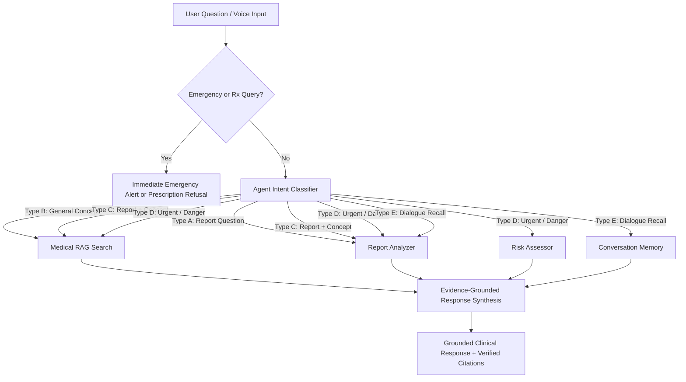

# Agentic AI Architecture & Tool Orchestration

## 1. Why an AI Agent?
Traditional chatbots treat every user question identically—either calling a search engine blindly or guessing an answer from parametric memory. 

In healthcare laboratory analysis, different questions demand completely different capabilities:
- Answering *"What is my hemoglobin?"* requires **data extraction from the active report**, NOT general medical search.
- Answering *"What does creatinine mean?"* requires **authoritative clinical RAG**, NOT report extraction.
- Answering *"My creatinine is high, what causes this?"* requires **both report extraction AND authoritative clinical RAG**.
- Answering *"Is this dangerous?"* requires **clinical triage risk assessment**.
- Answering *"What did you say earlier?"* requires **conversation memory recall**.

An **Agentic AI Coordinator** dynamically reasons about user intent and selects only the necessary tools to formulate safe, grounded answers.

---

## 2. The 5 Discrete Agent Tools

| Tool Name | Purpose | Inputs | Outputs |
|---|---|---|---|
| **`tool_medical_rag_search`** | Vector database search over NIH/CDC clinical guidelines | `{ query, topK }` | List of retrieved chunks, URLs, organizations, relevance scores |
| **`tool_report_analyzer`** | Analyte value and unit extraction from active patient report | `{ report_id, parameter }` | Specific analyte name, value, unit, status |
| **`tool_lab_reference_analyzer`** | Strict bounds verification against printed laboratory interval | `{ value, reference_range }` | Normal, High, Low (avoids population bias) |
| **`tool_risk_assessor`** | Clinical triage urgency classification | `{ abnormal_findings }` | GREEN (routine), YELLOW (consultation), RED (prompt evaluation) |
| **`tool_conversation_memory`** | Context retrieval of earlier turns in dialogue | `{ conversation_id }` | Prior assistant explanations and patient queries |

---

## 3. Query Intent Classification & Routing



---

## 4. Safe Execution Trace Metadata
For developmental transparency and frontend verification, the system exposes safe execution metadata without leaking private internal reasoning:
```json
{
  "tools_used": ["REPORT_ANALYZER", "MEDICAL_RAG_SEARCH"],
  "documents_retrieved": 3,
  "rag_used": true,
  "sources": [
    {
      "topic": "Serum Creatinine",
      "organization": "National Institutes of Health (NIH MedlinePlus)",
      "url": "https://medlineplus.gov/lab-tests/creatinine-test/",
      "relevance_tier": "High"
    }
  ]
}
```

---

## 5. Multilingual Voice Agent Pipeline
When an elderly user speaks in Hindi or Hinglish:
1. **Speech-to-Text**: Converts audio stream into text via Web Speech API.
2. **Intent Classification & English Medical Term Preservation**: Key clinical analytes (e.g. *Creatinine*, *Hemoglobin*, *Platelets*) are isolated.
3. **Medical RAG Search**: Retrieves verified evidence from the knowledge base.
4. **Culturally Sensitive Synthesis**: Formulates plain-language, non-diagnostic guidance in Hindi or Hinglish.
5. **Text-to-Speech**: Speaks the response aloud at a comfortable, elderly-friendly pace.
